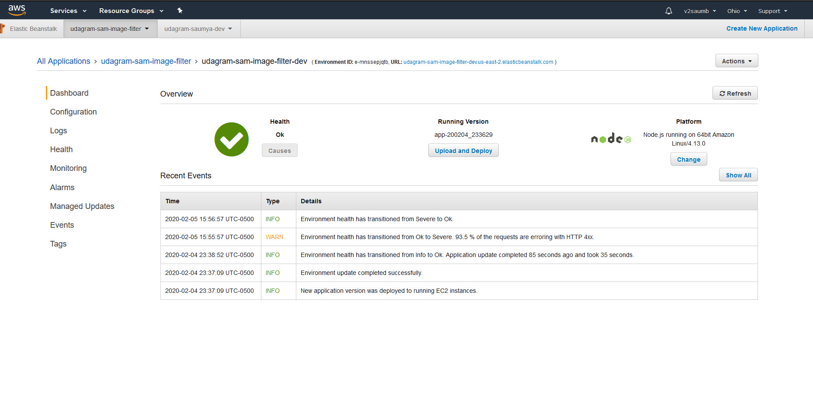
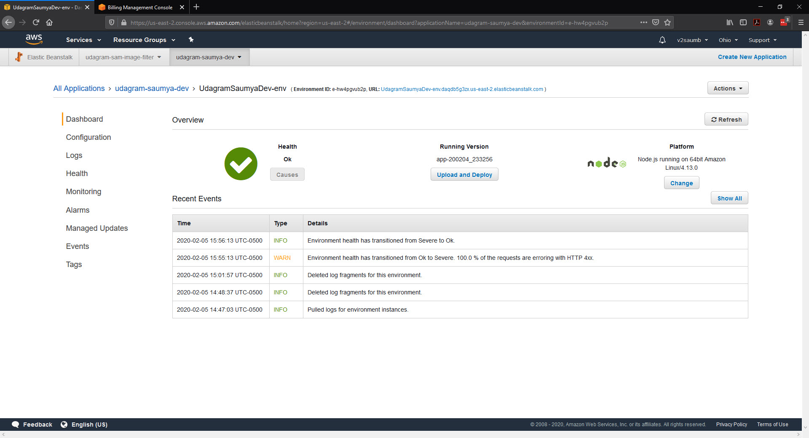

# Udagram Image Filtering Microservice

Udagram is a simple cloud application developed alongside the Udacity Cloud Engineering Nanodegree. It allows users to register and log into a web client, post photos to the feed, and process photos using an image filtering microservice.

The project is split into three parts:
1. [The Simple Frontend](https://github.com/v2saumb/cloud-developer/tree/master/course-02/exercises/udacity-c2-frontend)
A basic Ionic client web application which consumes the RestAPI Backend. 

Additional Changes

- Personalized the front end, changed the look of the application a bit
- Made changes to resolve duplicate submit. 
- [FrontEnd URL]() 

2. [The RestAPI Backend](https://github.com/v2saumb/cloud-developer/tree/master/course-02/exercises/udacity-c2-restapi), a Node-Express server which can be deployed to a cloud service. 

Additional changes

- Refactored the code to call the Image filter service. Currently handling it only at the time of posting the feed. TODO - optimize the service so we dont have to transfer the images back and forth
- Additional logging for debugging 
- Used TinyUrl api to reduce the S3 signed URL's
- [Rest Service  URL]() 

3. [The Image Filtering Microservice](https://github.com/v2saumb/cloud-developer/tree/master/course-02/project/image-filter-starter-code), the final project for the course. It is a Node-Express application which runs a simple script to process images. 

Additional Changes

- Setup the environment, initialize and deploy using beanstalk
- Added Authorization
- Added code to delete the temporary files after processing
- [Image Filter Service URL]()

## Tasks List

- [x] Setup Node Environment
- [x] Create a new endpoint in the server.ts file
- [x] Deploying your system
   
## Stand Out (Optional)

- [x] Refactor the course RESTapi
- [x] Authentication
- [ ] Custom Domain Name

## Deployment Screenshots

- Image Filter Service

- Rest Api

